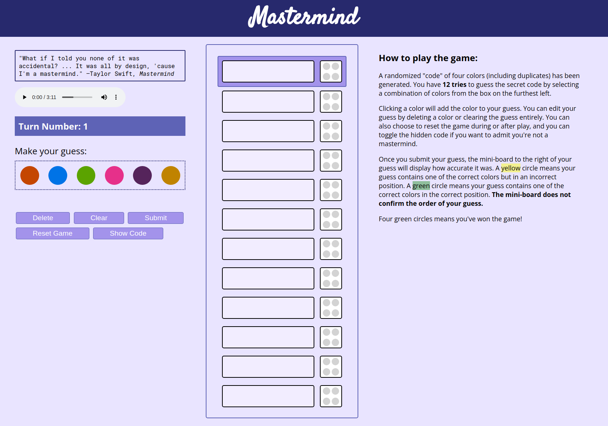
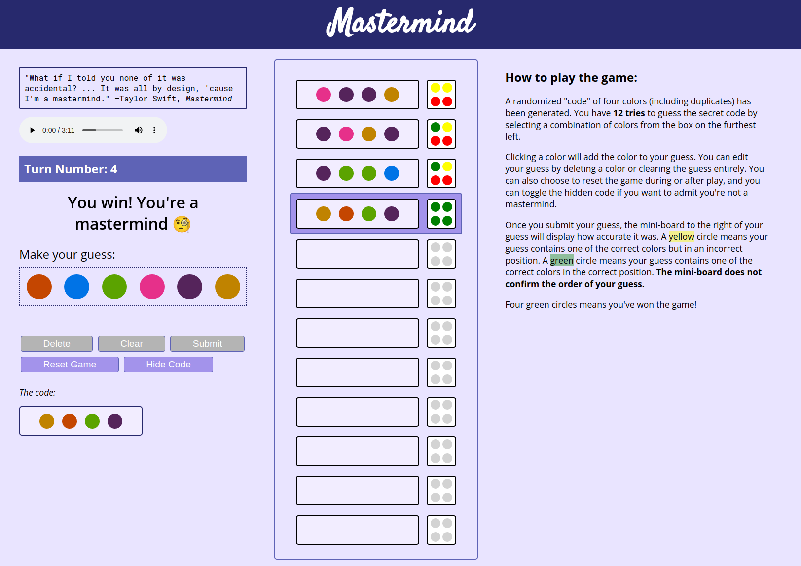

<h1 align="center">Mastermind</h1>

<!-- TABLE OF CONTENTS -->

  
Table of Contents

  <ol>
    <li><a href="#about-the-project">About the Project</a></li>
    <li><a href="#screenshots">Screenshots</a></li>
    <li><a href="#technologies-used">Technologies Used</li>
    <li><a href="#play-the-game">Play the Game</a></li>
    <li><a href="#next-steps">Next Steps</a></li>
    <li><a href="#resources">Resources</a></li>
  </ol>

## About the Project

[Mastermind](<https://en.wikipedia.org/wiki/Mastermind_(board_game)>) is a code-breaking game traditionally played by two players, with one being the "codemaker" and the other the "codebreaker."

In this version of the game, the player plays as the codebreaker trying to guess a code that has been randomized by the program. The code consists of four colors selected from six possible colors, where duplicates _are_ possible. The player has 12 turns to guess the code before they lose.

Once a player makes a guess, a miniature board ("miniboard") will display colors indicate how accurate their guess was. A green circle indicates a correct color in the correct position. A yellow circle indicates a correct color but in the incorrect position. A red circle indicates no match. The miniboard **does not** necessarily confirm the order of the guess.

## Screenshots

## Technologies Used

- HTML
- CSS
- JavaScript

## Play the Game

You can play the game by clicking [here](https://lehelen19.github.io/mastermind/)!

Feel free to submit a pull request if you would like to suggest any changes.

## Next Steps

- Add a color-blind option
- Hide the game instructions in a modal that opens upon click
- Add an animated background and/or other style enhancements; refactor for accessibility and responsiveness

## Resources

- [A great README.md template](https://github.com/othneildrew/Best-README-Template)
- [CSS Animation Library](https://animate.style/)
- [CSS Flexbox Guide](https://css-tricks.com/snippets/css/a-guide-to-flexbox/) (just because it's always helpful!)
